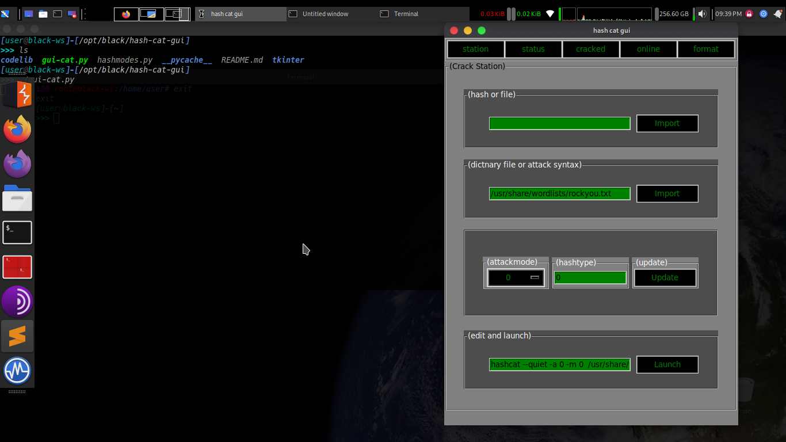

# hash-cat-gui

hash cat gui

* hashcat gui model

**requirements:**

* tkinter
* python3
* hashcat

**Os:**

* probablly linux
* possibly mac
* may be windows with your effort

**installation:**

```bash
$ apt-get install python3 python3-tk hashcat
```


**run:**

```bash
$ ./gui-cat.py
```


